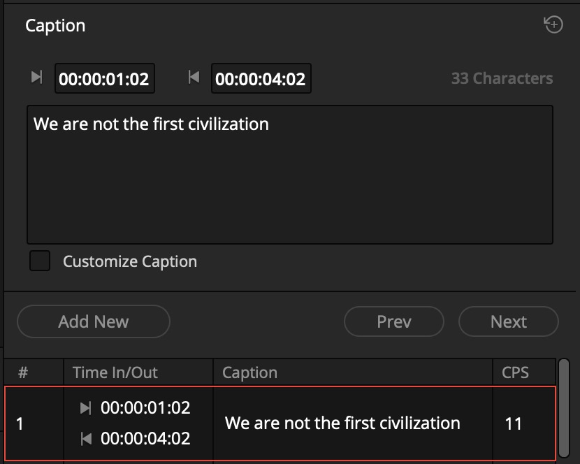
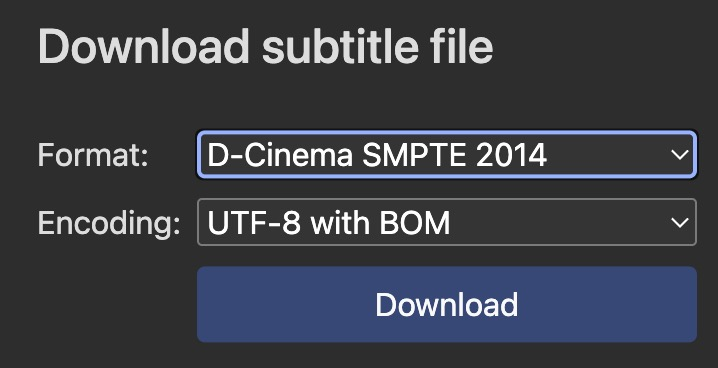

# DCDM_3DSUB_XSLT
Tools for Digital Cinema 3D subtitles

the xslt stylesheet adds the attribute Zposition to every Text element in a DCDM subtitleReel

## Requirements
- **xsltproc** for xml stylesheet transformation
https://gitlab.gnome.org/GNOME/libxslt/-/wikis/home
- **xmllint** for validation
https://gitlab.gnome.org/GNOME/libxml2/-/wikis/home

<picture>
   
</picture>

## Workflow
1. create 2D srt sub in Davinci Resolve
2. Export srt subs to a file
3. Import srt to https://www.nikse.dk online Subtitle Editor
4. Download Subtitle as Digital Cinema Subtitle D-Cinema SMPTE 2014
5. run the XSLT transformation

<picture>
   
</picture>
   
## Transformation
```
xsltproc -o MOVIE_SUBS_3D_with_Z.xml add_Zposition.xsl MOVIE_SUBS_2D.xml
```

## Validation
```
xmllint --noout --schema DCDMSubtitle-2014.xsd MOVIE_SUBS_3D_with_Z.xml
```
## Background
tools are used to prepare the stereoscopic 3D screening of the Busan International Short Film Festival BISFF.
https://www.bisff.org/
